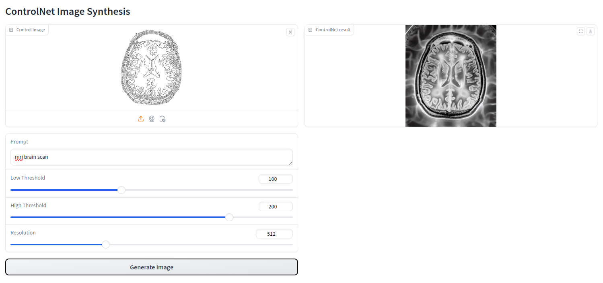

# ControlNet with simple web frontend

This repository provides a dockerized application with a simple web interface to send image generation requests to 
ControlNet running in the backend. This project is mainly built on FastAPI and gradio. 

## Structure
The application is structured into a frontend and a backend part, where the frontend application provides a user 
interface and sends corresponding POST requests to the backend. The backend receives the image generation configuration
and uses ControlNet to synthesize a new image to return. Note that the repository does not store the network weights
for ControlNet, therefore, these need to be obtained from 
[Huggingface](https://huggingface.co/lllyasviel/ControlNet/blob/main/models/control_sd15_canny.pth) and placed into 
the *models* folder inside ControlNet directory.

Moreover, the backend can also be accessed programmatically to request synthesized images from the command line, e.g. 
with *curl* or from another Python application. See [demo](send_post_request.py) for an example.

Screenshot of the Web application:


## Commands
The full application can be built and locally deployed with:
```bash
docker compose build
docker compose up
```

Please note that the current version only supports CPU devices, and not yet CUDA. This results in slow image generation 
which may take a few minutes. 

In case of troubleshooting and the need to inspect the running containers, you can access them via:
```bash
docker exec -t -i controlnet-frontend /bin/bash
docker exec -t -i controlnet-backend /bin/bash
```